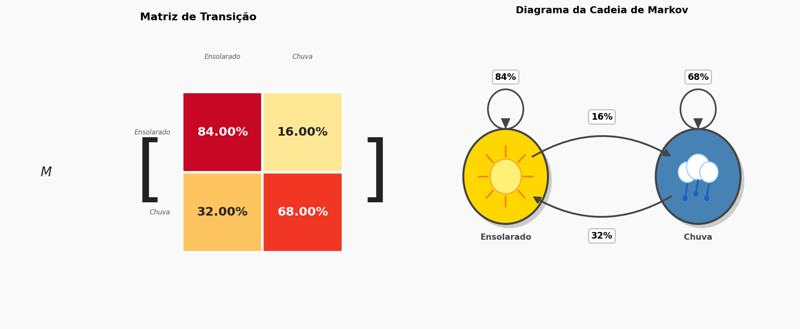
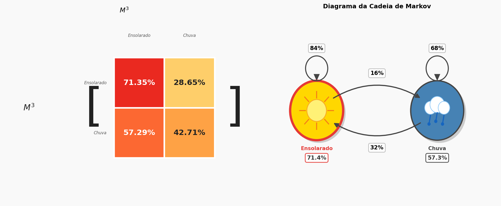
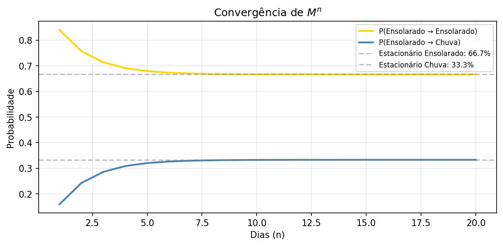

# Previsão do Tempo com Cadeias de Markov

Modelo probabilístico de previsão do tempo baseado em **Cadeias de Markov**, com visualizações interativas em Python.

---

## Sobre o projeto

A partir de uma matriz de transição entre os estados **Ensolarado** e **Chuvoso**, o modelo calcula a probabilidade do tempo em qualquer dia futuro, usando diagonalização de matrizes e álgebra linear.

O usuário informa o estado do tempo hoje e quantos dias à frente deseja prever. O sistema retorna as probabilidades e gráficos gerados automaticamente.

---

## Visualizações

**Diagrama da Cadeia de Markov e Matriz de Transição**


**Previsão para 3 dias (partindo de Ensolarado)**


**Convergência de Mⁿ ao estado estacionário**


---

## Como funciona

A matriz de transição $M$ define as probabilidades de mudança entre estados:

|       | Sol  | Chuva |
|-------|------|-------|
| Sol   |  84% |  16%  |
| Chuva |  32% |   68% |


Para prever $n$ dias à frente, calcula-se $M^n$ via **diagonalização**:

$$M^n = P \cdot D^n \cdot P^{-1}$$

O estado estacionário (distribuição de longo prazo) é obtido pelo **autovetor esquerdo** associado ao autovalor 1.

---

## Tecnologias

- Python 3
- NumPy — álgebra linear e diagonalização
- SymPy — cálculo simbólico para $n$ genérico
- Matplotlib — visualizações

---

## Como executar

1. Clone o repositório:
```bash
git clone https://github.com/ajguiseli/markov-weather.git
cd markov-weather
```

2. Instale as dependências:
```bash
pip install numpy matplotlib sympy
```

3. Abra o notebook no Jupyter ou VSCode:
```bash
jupyter notebook previsao_do_tempo.ipynb
```

4. Execute todas as células e responda às perguntas interativas.

---

## Conceitos abordados

- Cadeias de Markov de tempo discreto
- Diagonalização de matrizes
- Autovalores e autovetores
- Distribuição estacionária
- Cálculo simbólico com SymPy
